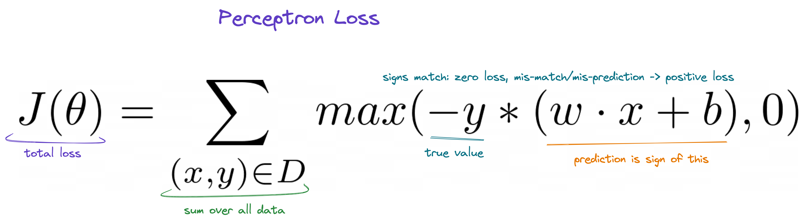
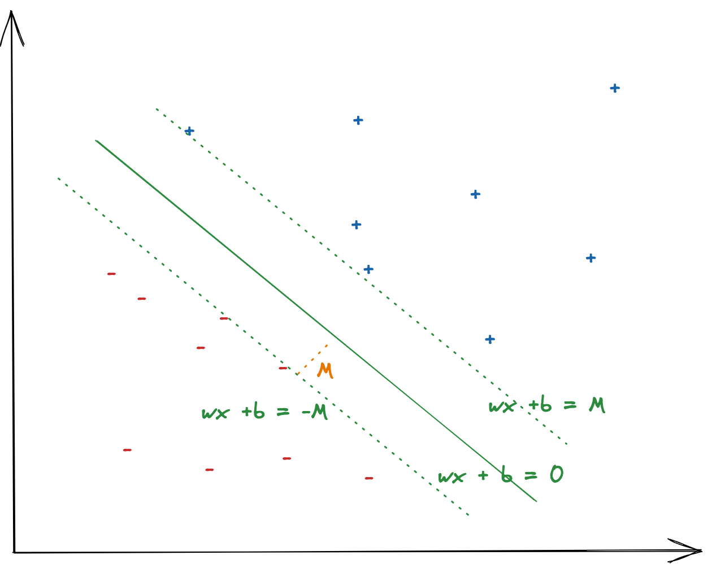
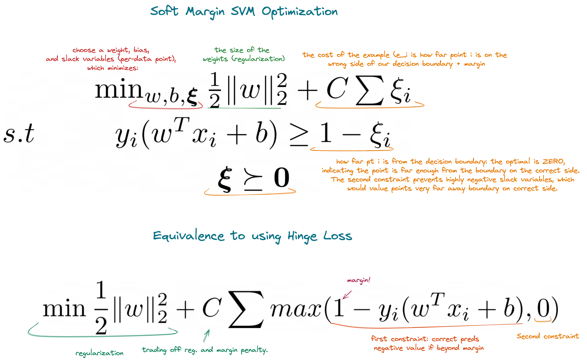

a Simple SVM from scratch (numpy components only, imperfect implementation)

## Perceptron

### Model
We posit that we can separate binary classes $y \in \{-1, 1\}$ with a learned vector of weights, dotted into features:

$$
\hat{y} = \bf{w} \cdot \bf{x} + b
$$

### Loss

The perceptron learns $w, b$ with the following loss function:

### Algorithm

Gradient descent.

## Support Vector Machines

### Model

Same as perceptron:

$$
\hat{y} = \bf{w} \cdot \bf{x} + b
$$

### Loss / Optimzation

#### Aside: Why is minimizing the norm given a fixed margin equivalent to maximizing the margin?

This is often given in discussion of SVMs but stems from the formula for distance between two parallel lines. The margin of an SVM can be modelled as two parallel lines to the decision boundary, where the decision boundary is given by 

$$
w^Tx + b = 0
$$

Where here $M$ is the margin. Lets consider the two lines (in 2D case), re-written as such:

$$
w_1x_1 + w_2x_2 + b = 0
$$

$$
w_1x_1 + w_2x_2 + (b - M) = 0
$$

[The distance between two parallel lines is proven here.](https://en.wikipedia.org/wiki/Distance_between_two_parallel_lines). Skipping steps in proof linked, we arrive at $d$ = 

$$
\frac{|(b-M) - b|}{\sqrt{w_1^2 + w_2^2}} = \frac{M}{||w||}
$$

Thus to maximize this distance, we can minimize $||w||$ (or its square) for a fixed $M=1$. Below we write this out, with addition of slack variables, and their removal/obfuscation in hinge loss.

### Loss/Optimization

### Gradients

Finally, if our loss is:

$$
J(w) = \min \frac{1}{2}\Vert w \Vert_2^2 + C\sum max(1 - y_i(w^Tx_i + b), 0)
$$

Then our gradient w.r.t $w$ is:

$$
\frac{\delta J}{\delta w} = ||w|| + C \sum_{(x_i, y_i) \in D \text{ if } 1 - y_i(w^Tx_i + b) > 0} -y_ix_i
$$

### Algorithm

Gradient decsent with known convergence: pick a learning rate `5-e4` and keep updating weights until max iterations 
have passed or we are pass tolerance threshold. See `fit` in `svm.py`

## Result

Mostly seems to work, but doesn;t consistently converge to the exact same values as in `LinearSVC`. I suspect I am doing something slightly wrong in the gradient update or stop criteria. Still, frmo repeated runs it is clear that the margin learned is much higher than chance, among choices of decision functions that partition the data.
